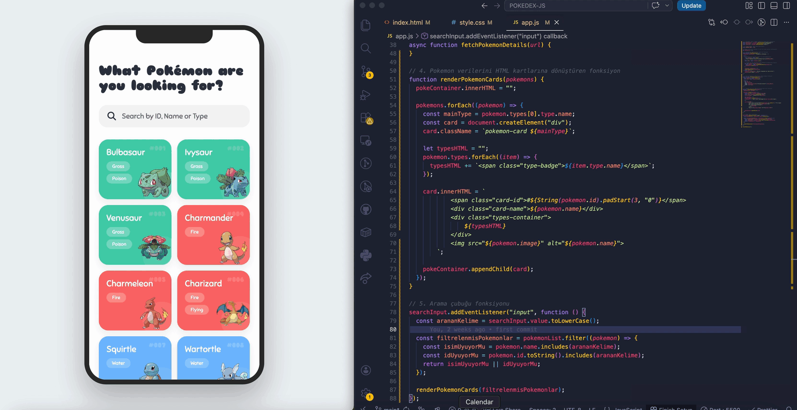

# 🎮 Pokedex Guide: iPhone Edition

This project is a modern, mobile-first **Pokedex Application** that showcases the first 151 Pokémon within a realistic smartphone interface. It combines a sleek UI with live data from the PokéAPI.

---

## ✨ Features

- **iPhone Frame UI:** The app is wrapped in a realistic iPhone container with a notch and rounded corners for a premium mobile feel.
- **Live Search & Filter:** Users can instantly search for Pokémon by **Name**, **ID** (e.g., 001), or **Type** in real-time.
- **Dynamic Color Theming:** Each Pokémon card automatically inherits a background color based on its primary element (Fire, Water, Grass, etc.).
- **Responsive Grid:** A clean, 2-column layout designed specifically for mobile interaction.
- **High-Quality Assets:** Fetches official high-resolution artwork for every Pokémon.
- **Smooth Animations:** Includes hover effects, scale transitions, and glassmorphism (blur) effects on badges.

---

## 📚 Technologies Used

- **HTML5 & CSS3:** Custom CSS Grid and Flexbox layouts.
- **JavaScript (ES6):** Fetch API for data handling, DOM manipulation, and real-time search logic.
- **PokéAPI:** The RESTful Pokémon API for live data.
- **Google Fonts:** "Sniglet" for a playful, Pokémon-themed typography.
- **Font Awesome 6:** For high-quality interface icons.

---

🚀 Installation
Clone the repository:git clone https://github.com/fundagungoralkan/Vanilla-JS-PokeAPI-Dashboard

